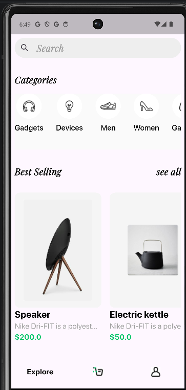

# E-Commerce App(Shoply)

A modern, full-featured e-commerce application built with Flutter, designed to provide a seamless and secure shopping experience.

## 🚀 Features

- **User Authentication**: Secure Login and Sign-up using Firebase Auth, including Google Sign-in integration.
- **Product Discovery**: Browse products by categories and explore featured items on the home screen.
- **Detailed Product Views**: View high-quality images, descriptions, and details for every product.
- **Shopping Cart**: Easily add, remove, and manage items in your cart with real-time updates.
- **Secure Checkout**: A streamlined checkout process for a smooth purchasing flow.
- **Stripe Payments**: Integrated secure payment processing using the Flutter Stripe SDK.
- **Profile Management**: Manage user profiles, including account details and profile image updates.
- **Real-time Backend**: Powered by Firebase Firestore and Supabase for reliable data management.
- **Localizations**: Support multi languages(en,ar).
## 🛠️ Tools & Technologies

- **Framework**: [Flutter](https://flutter.dev/)
- **State Management**: [GetX](https://pub.dev/packages/get) (for navigation and reactive state management)
- **Backend Services**: 
  - [Firebase](https://firebase.google.com/) (Authentication & Cloud Firestore)
  - [Supabase](https://supabase.com/)
- **Payment Gateway**: [Stripe](https://stripe.com/)
- **Networking**: [Dio](https://pub.dev/packages/dio)
- **Local Storage**: [GetStorage](https://pub.dev/packages/get_storage) & [SharedPreferences](https://pub.dev/packages/shared_preferences)
- **UI Enhancements**:
  - `Ionicons` & `Flutter SVG` for iconography.
  - `Fancy Shimmer Image` for elegant image loading.
  - `Flutter Slidable` for interactive list actions.
  - `Image Picker` for profile photo updates.

## 📦 Key Packages

| Category | Package |
| :--- | :--- |
| **State Management** | `get` |
| **Backend** | `firebase_core`, `firebase_auth`, `cloud_firestore`, `supabase_flutter` |
| **Payments** | `flutter_stripe` |
| **Networking** | `dio` |
| **Utilities** | `intl`, `uuid`, `flutter_dotenv` |
| **UI** | `ionicons`, `flutter_svg`, `fancy_shimmer_image`, `flutter_slidable`, `image_picker` |

## 📸 Screenshots

---
Developed with ❤️ using Flutter.
